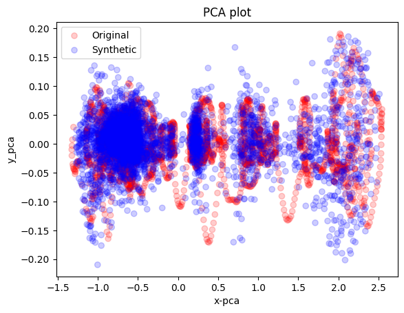
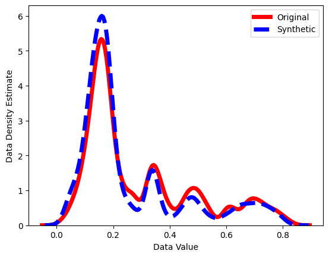

# Wavelet Diffusion and Progressive Distillation for Time Series synthesis 

  
  
  

  
  
  

## Project Description 

(THIS REPO IS STILL A WORK IN PROGRESS) This repository provides an extension of the Diffusion-TS model, proposed in https://github.com/Y-debug-sys/Diffusion-TS, by changing the underlying logic for learning the Seasonal and Trend components of the time series, exploiting the Wavelet Transform rather than the Fourier Transform. 
It also provides an implementation of Progressive Distillation, extending it to the Time Series domain. 

## Progressive Distillation 
Distillation of the originally trained model teaches a student to sample with half the Diffusion steps of the teacher, rendering the original network into a narrower, faster one. The training procedure follows the one originally proposed in "Progressive Distillation for Fast Sampling of Diffusion Models", by Tim Salimans and Jonathan Ho https://openreview.net/forum?id=TIdIXIpzhoI . 

This is all work for my Master's Thesis, which is still in progress, thus the code will still be most likely subject to changes / additions. The attached Jupyter Notebook can be run in Google Colab, obtaining reasonable computational times even with the weakest GPUs available. 
## Acknowledgements

For the design of the Diffusion architecture, and of the Wavelet block, I have made use of the following github repos:

https://github.com/fbcotter/pytorch_wavelets

https://github.com/lucidrains/denoising-diffusion-pytorch

https://github.com/Y-debug-sys/Diffusion-TS

https://github.com/cientgu/VQ-Diffusion

https://github.com/XiangLi1999/Diffusion-LM

https://github.com/philipperemy/n-beats

https://github.com/salesforce/ETSformer

https://github.com/ermongroup/CSDI

https://github.com/jsyoon0823/TimeGAN
