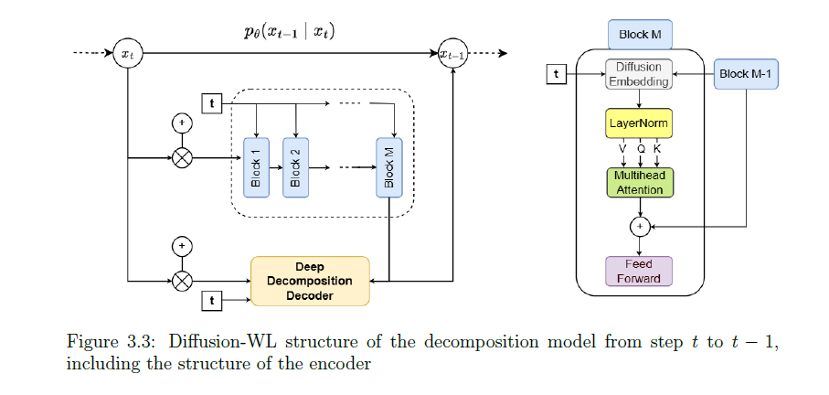
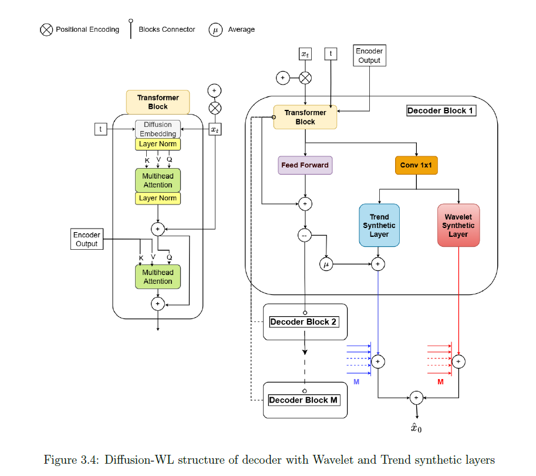

# Wavelet Diffusion and Progressive Distillation for Time Series synthesis 

## Project Description 

This repository is the main source code of my master of science thesis at Bocconi University, titled: "Diffusion Wavelet: Interpretable diffusion and Progressive Distillation for time series synthesis". It provides an extension of the Diffusion-TS model, proposed in https://github.com/Y-debug-sys/Diffusion-TS, by changing the underlying logic for learning the Seasonal and Trend components of the time series, exploiting the Wavelet Transform rather than the Fourier Transform. 
It also provides an implementation of Progressive Distillation, extending it to the Time Series domain.
The repository is to be refined for code readability, but it is fully functional. The colab notebook provided can be quickly exploited to train the diffusion models on GPUs. 

## Model's Encoder-Decoder structure



## Progressive Distillation 
Distillation of the originally trained model teaches a student to sample with half the Diffusion steps of the teacher, rendering the original network into a narrower, faster one. The training procedure follows the one originally proposed in "Progressive Distillation for Fast Sampling of Diffusion Models", by Tim Salimans and Jonathan Ho https://openreview.net/forum?id=TIdIXIpzhoI , with slight adaptions due to the use of stochastic samplers. 

## Datasets 
All the real-world datasets (Stocks, ETTh1, Energy and fMRI) used in my thesis can be obtained from [Google Drive](https://example.com). All relevant datasets can be exctracted and placed in the ./Datasets/datasets folder.

## Running the code 
The code requires conda3 (or miniconda3), and one CUDA capable GPU. The ipykernel notebooks and Colab notebooks attached can be used to run code, sample, and deliver useful graphical representations. Below I show examples of how to train the model directly from the terminal using main.py. 

## Environment & Libraries
The full libraries list is provided as a requirements.txt in this repo. Please create a virtual environment with conda or venv and run

```bash
(.myenv) $ pip install -r requirements.txt
```

## Training 
For training, you can then proceed by running the following command on any of the datasets for which you have setup a yaml config. It is always possible to add new datasets as long as you specify correctly the configuration. 

```bash
(.myenv) $ python main.py --name {name} --config_file {local_path\config.yaml} --gpu 0 --train
```

## Acknowledgements

For the design of the Diffusion architecture, and of the Wavelet block, I have made use of the following github repos:

https://github.com/fbcotter/pytorch_wavelets

https://github.com/lucidrains/denoising-diffusion-pytorch

https://github.com/Y-debug-sys/Diffusion-TS

https://github.com/cientgu/VQ-Diffusion

https://github.com/XiangLi1999/Diffusion-LM

https://github.com/philipperemy/n-beats

https://github.com/salesforce/ETSformer

https://github.com/ermongroup/CSDI

https://github.com/jsyoon0823/TimeGAN
