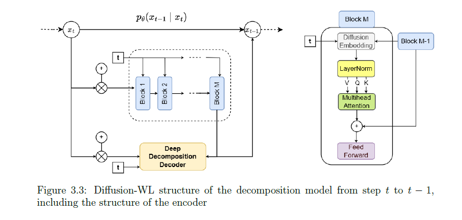
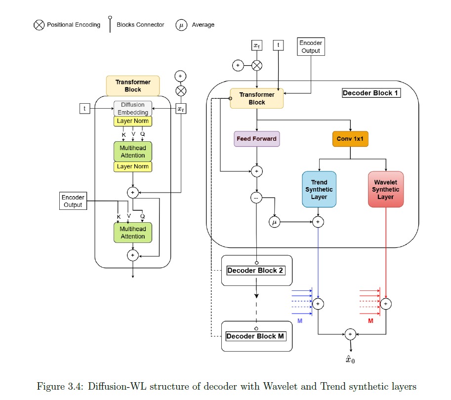

# Diffusion-WL: Wavelet Diffusion with Progressive Distillation for Time Series Synthesis

## Project Description

This repository is the source code of a master's thesis at Bocconi University: *"Diffusion Wavelet: Interpretable Diffusion and Progressive Distillation for Time Series Synthesis"*.

It extends the [Diffusion-TS](https://github.com/Y-debug-sys/Diffusion-TS) model by replacing the Fourier-based seasonal/trend decomposition with the **Discrete Wavelet Transform (DWT)**, enabling richer multi-resolution time-frequency representations.

After training, **progressive distillation** can compress the model from 500 down to as few as 4–8 sampling steps, reducing inference time by an order of magnitude with minimal quality loss.

## Model Architecture

The model (`DiffusionWL`) follows an encoder-decoder design. The decoder separates each denoising step into a **trend** and **seasonal** component via wavelet decomposition.

<div align="center">
  
  <br><br>
  
</div>

## Progressive Distillation

Distillation teaches a student to reproduce the teacher's output in half the diffusion steps. Each round halves the step count:

```
Teacher: 500 steps → Student 0: 250 → Student 1: 125 → ... → Student N: ~4–8 steps
```

The procedure follows [Salimans & Ho (2022)](https://openreview.net/forum?id=TIdIXIpzhoI), adapted for stochastic samplers.

## Datasets

All real-world datasets (Stocks, ETTh1, Energy, fMRI) used in the thesis are available on [Google Drive](https://example.com). Extract them into `./Datasets/datasets/`.

Supported dataset classes:
| Dataset | Config | Class |
|---------|--------|-------|
| Stock prices | `Configs/stocks.yaml` | `CustomDataset` |
| ETTh1 | `Configs/etth.yaml` | `CustomDataset` |
| Energy | `Configs/energy.yaml` | `CustomDataset` |
| fMRI | `Configs/fmri.yaml` | `fMRIDataset` |
| Synthetic sines | `Configs/sines.yaml` | `SineDataset` |

## Environment Setup

Requires Python 3.8+. Create a virtual environment and install dependencies:

```bash
pip install -r requirements.txt
```

## Training

Train a diffusion model on any configured dataset:

```bash
python main.py --name <run_name> --config_file Configs/stocks.yaml --train
```

To use a specific GPU:

```bash
python main.py --name <run_name> --config_file Configs/stocks.yaml --train --gpu 0
```

For CPU-only training, omit `--gpu` — the code automatically falls back to CPU.

Key config parameters (edit the `.yaml` file to change them):
| Parameter | Description |
|-----------|-------------|
| `solver.max_epochs` | Training steps |
| `solver.save_cycle` | Checkpoint every N steps |
| `model.params.timesteps` | Number of diffusion steps |
| `dataloader.batch_size` | Batch size |

Checkpoints are saved to `./Checkpoints_<dataset>_<seq_length>/checkpoint-<N>.pt`.

## Sampling

Load a trained checkpoint and generate synthetic time series:

```bash
python main.py --name <run_name> --config_file Configs/stocks.yaml --milestone <checkpoint_number>
```

Where `--milestone` is the checkpoint index (e.g. `10` loads `checkpoint-10.pt`). Generated samples are saved to `OUTPUT/<run_name>/ddpm_fake_<run_name>.npy`.

## Progressive Distillation

Distillation teaches a student to reproduce the teacher's output in half the diffusion steps. Each round halves the step count:

```
Teacher: 500 steps → Student 0: 250 → Student 1: 125 → ... → Student N: ~4–8 steps
```

The procedure follows [Salimans & Ho (2022)](https://openreview.net/forum?id=TIdIXIpzhoI), adapted for stochastic samplers.

**Train then distill in one command:**

```bash
python main.py --name <run_name> --config_file Configs/stocks.yaml --train --distill --distill_iters 4
```

**Distill from an existing checkpoint:**

```bash
python main.py --name <run_name> --config_file Configs/stocks.yaml --distill --milestone <checkpoint_number> --distill_iters 4
```

`--distill_iters N` controls the number of rounds (default: 4). Each round halves the sampling steps, so 4 rounds reduces 500 steps → 31 steps. Distilled checkpoints are saved as `distill-<student_idx>-final-<milestone>.pt` in the same results folder.

## Evaluation

Evaluation metrics (Context-FID, discriminative score, predictive score, correlation) are computed in the provided notebooks:

- `Diffusion_Wavelet_Colab.ipynb` — training and evaluation on Colab (GPU)
- `Running-Tutorial.ipynb` — local tutorial notebook
- `Graphs/` — visualization notebooks for comparing generated vs real samples

A Colab notebook for training and evaluation is also available [here](https://colab.research.google.com/drive/1elaiT7NVuzLu87uAe-iaCnvA-gnETrkc).

## Repository Structure

```
.
├── Configs/              # YAML config files per dataset
├── Datasets/             # Dataset loading utilities
├── Engine/
│   ├── trainer.py        # Training, distillation, and sampling loop
│   ├── logger.py         # TensorBoard + file logging
│   └── scheduler.py      # LR scheduler with warmup
├── Models/
│   ├── interpretable_diffusion/
│   │   ├── gaussian_diffusion.py   # DiffusionWL base model
│   │   ├── wavelet_transformer.py  # Encoder-decoder with DWT
│   │   ├── model_utils.py          # Shared building blocks
│   │   └── wave1d.py               # DWT1D forward/inverse
│   ├── knowledge_distillation/
│   │   └── progressive_distillation.py  # DiffusionWL student model
│   └── ts2vec/                     # TS2Vec encoder for Context-FID
├── Utils/
│   ├── io_utils.py           # Config loading, model instantiation
│   ├── compute_metrics.py    # Metric orchestration
│   ├── masking_utils.py      # Missing value / padding masks
│   └── fix_tensors.py        # State dict utilities for distillation
├── Graphs/               # Visualization notebooks
├── main.py               # Entry point
└── requirements.txt
```

## Acknowledgements

This project builds on:
- [Diffusion-TS](https://github.com/Y-debug-sys/Diffusion-TS)
- [pytorch_wavelets](https://github.com/fbcotter/pytorch_wavelets)
- [denoising-diffusion-pytorch](https://github.com/lucidrains/denoising-diffusion-pytorch)
- [VQ-Diffusion](https://github.com/cientgu/VQ-Diffusion)
- [Diffusion-LM](https://github.com/XiangLi1999/Diffusion-LM)
- [N-BEATS](https://github.com/philipperemy/n-beats)
- [ETSformer](https://github.com/salesforce/ETSformer)
- [CSDI](https://github.com/ermongroup/CSDI)
- [TimeGAN](https://github.com/jsyoon0823/TimeGAN)
